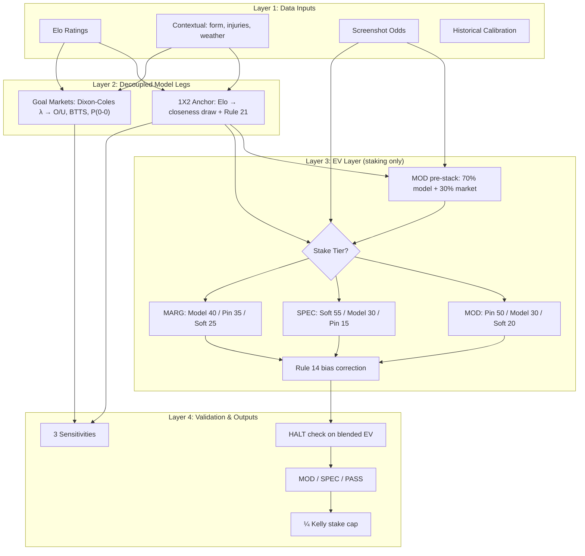

# WCdecider Model Pipeline v4.1 — Production Architecture

**Version:** 4.1 · **Date:** 2026-06-15 · **Status:** Production (post Iteration 5, N=222 backtest)

## Executive Summary

After six parallel subagent reviews (degrees 1–6), three iterative backtest rounds (N=9 → N=222), and Iteration 5 stacking sweep, the winning production stack is:

| Leg | Model | Rationale |
|-----|-------|-----------|
| **1X2 anchor** (reporting) | `v4_elo` (Elo + Rule 21, draw_base=0.20, opener_boost=0.07) | Brier 0.6157 on N=222; best structural model vs v31 |
| **MOD EV pre-stack** | 70% model + 30% market implied | Brier 0.6039 (−0.0118 vs anchor); traps=0 |
| **O/U, BTTS, P(0-0)** | Dixon-Coles bivariate Poisson (ρ=-0.07) | Correct low-score correlation for combos |
| **EV / staking** | Rule 24 tier ensemble on stacked MOD leg | MOD: Pin 50% / model 30% / soft 20%; SPEC: soft 55% |
| **Classification** | On **blended + Rule 14** EV | HALT on blended EV >25%; MOD favorites PASS |
| **Stake suggestion** | Conservative Kelly (±3pp draw bands) | Degree 6 hook; does not alter classification |

**Do not** blend Dixon-Coles or BTD into 1X2 — backtest proves it degrades draw calibration.
**Do not** apply global 50/50 stack in production — best Brier but overfits market; MOD-only 70/30 preserves SPEC alpha.

## File Map

| File | Role |
|------|------|
| `wc_model_v4_1_ensemble.py` | **Production v4.1** stack |
| `wc_model_v4_ensemble.py` | v4.0 anchor (regression reference) |
| `wc_backtest_framework.py` | N=222 CV, trap analysis, hyperparameter sweeps |
| `wc_model_iteration_runner.py` | Iteration 5 stacking sweep + time-split CV |
| `wc_replicable_pipeline.py` | v3.1 replicable baseline (unchanged; regression-locked) |
| `wc_ensemble_degree2.py` | DC+BTD research leg (O/U + comparison) |
| `wc_model_v3.py` | Full v3 with sensitivities, DC joints, hardcoded Elo |
| `wc_2026_model_dataset.csv` | June 15–16 slate with provenance |

## Architecture Diagram



## v4 Hyperparameters (constrained tune, N=9)

| Parameter | v3.1 | v4 | Source |
|-----------|------|-----|--------|
| `opener_draw_boost` | 0.055 | **0.07** | LOO + draw shock calibration |
| `draw_closeness_base` | 0.18 | **0.20** | Degree-1 variational search |
| `mu_total_default` | 2.4 | **2.25** | MD1–3 observed ~2.0 goals/game |
| `rho` (Dixon-Coles) | — | **-0.07** | Literature default (Dixon & Coles 1997) |
| HALT threshold | +25% raw | **+25% blended** | Rule 13 extension |

## Rule 24 — Tier-Conditional Ensemble

```python
MODERATE  (implied p > 40% or odds < 2.5):  sharp 50%, model 30%, soft 20%
SPECULATIVE (implied p < 25% or odds >= 4.0): soft 55%, model 30%, sharp 15%
MARGINAL  (else):                            model 40%, sharp 35%, soft 25%
```

**Counterfactual:** Netherlands @2.15 (MD2) — v3 raw EV +6% MOD → loss S/30; v4 blended EV −8.2% → PASS.

## Run Instructions

```bash
# v4.1 production demo
python3 wc_model_v4_1_ensemble.py

# Full N=222 backtest + comparison
python3 wc_backtest_framework.py

# Iteration 5 stacking sweep
python3 wc_model_iteration_runner.py

# Iteration 6 Bayesian search (6×5×2 zoom)
python3 wc_bayesian_model_search.py

# v3.1 replicable baseline (regression-locked)
python3 wc_replicable_pipeline.py

# All tests
python3 -m pytest tests/ -v
```

## v5 Roadmap (not blocking v4)

- EWMA + graph-regularized Elo (Degree 5 surrogate)
- Bayesian BTD with PyMC (Degree 6)
- Dynamic xG blend when `elo_gap > 450` + lineup confirmed
- Full temporal GNN post-tournament (insufficient N for WC group stage)

## References

- Dixon & Coles (1997), *Applied Statistics* 46(2):265-280
- Davidson (1970), Bradley-Terry draw extension
- Snowberg & Wolfers (2010), favorite-longshot bias, *JPE* 118(4)
- arXiv:2405.10247 — Bayesian BTD for football (2024)
- Hubáček et al. (2019) — sports betting ML, *Int J Forecasting* 35(2)